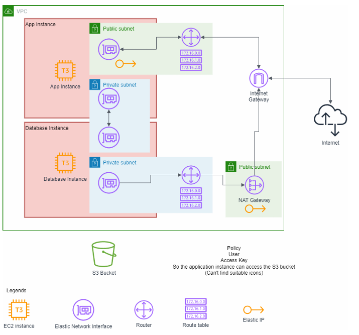

# Cloud Computing Technologies Midterm Project

This project is Cloud Computing Technologies Midterm Project "Infrastructure-as-Code". This repository contains the Terraform configuration for setting up a Virtual Private Cloud (VPC) on AWS and deploying WordPress application and database.

## Overview

This project demonstrates how to use Terraform to provision a VPC for WordPress application and database on AWS. The infrastructure setup includes running WordPress on an EC2 instance with two elastic network interfaces (ENIs), one for public access and the other for private communication with the database instance. The database runs on a separate EC2 instance with two ENIs, one for internet access via a NAT gateway and the other for communication with the WordPress application.

## Infrastructure Diagram

## Prerequisites

Before you begin, ensure you have the following prerequisites:

- Access to an EC2 instance with Terraform installed.
- AWS credentials with the necessary permissions for creating resources on AWS.

## Getting Started

To deploy the WordPress application and database using Terraform, follow these steps:

1. SSH into your EC2 instance.
2. Clone this repository to the EC2 instance.
4. Update the `terraform.tfvars` file with your desired configurations.
5. Initialize Terraform by running `terraform init`.
6. Review the execution plan by running `terraform plan`.
7. Apply the Terraform configuration by running `terraform apply` and confirming the changes.
8. Once the infrastructure is provisioned, access WordPress using the elastic IP associated with the public-facing ENI of the WordPress instance.
